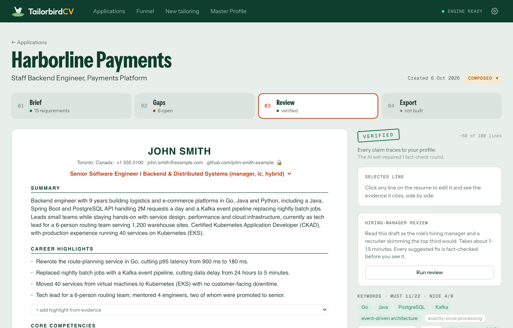
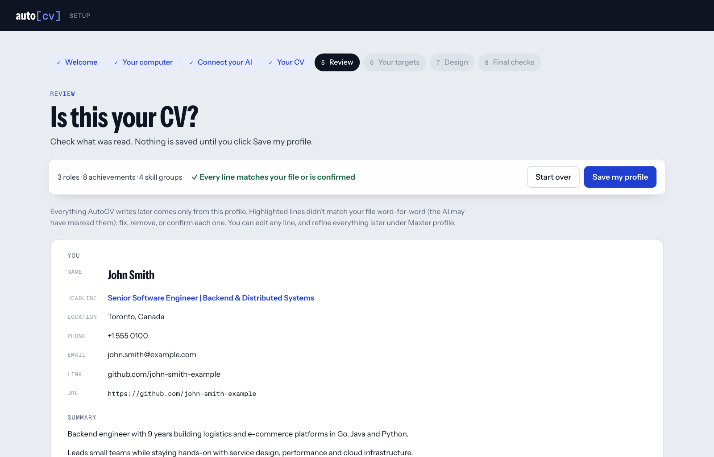
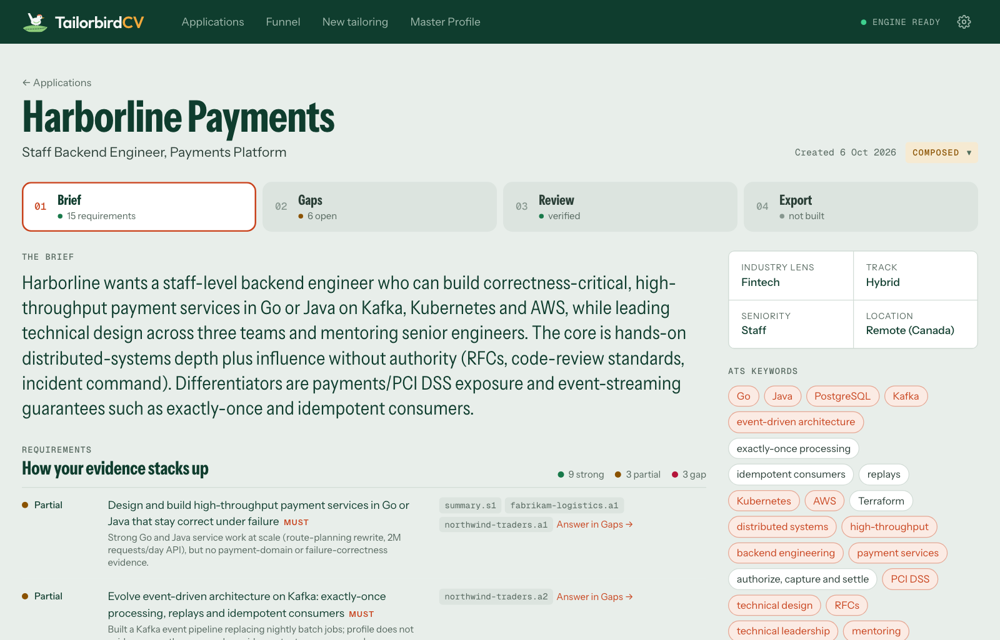
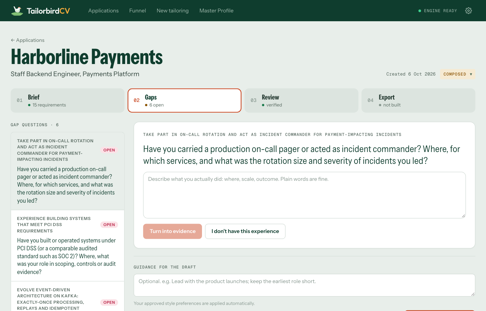

<p align="center"><picture><source media="(prefers-color-scheme: dark)" srcset="docs/logo-dark.png"></picture></p>

# TailorbirdCV

**Tailor your resume to each job, without inventing anything.**

Give TailorbirdCV your CV once. Then, for each job, paste the posting's link. TailorbirdCV:
- works out what the role cares about;
- asks you about anything the job wants that your CV doesn't show;
- writes a tailored resume from your real experience (and a cover letter, if you want one);
- builds a Word document and a PDF, ready to send.

A built-in fact-check makes sure every line comes from your own CV: no made-up numbers, tools, employers or claims. Your name, employers, job titles, dates and education are copied exactly.

TailorbirdCV runs on your own computer (macOS, Windows or Linux) and opens in your browser. The writing is done by the AI you choose.



## How it works
<picture><source media="(prefers-color-scheme: dark)" srcset="docs/how-it-works-dark.png"></picture>

Everything except the AI runs on your computer. Your CV becomes your **master profile**, the only place facts come from. The AI reads the job and writes the draft; TailorbirdCV checks every line against your profile before you see it.

## What you need
1. **An AI**, any one of:
   - a **Claude** subscription, with [Claude Code](https://claude.com/claude-code) installed and logged in. No extra cost;
   - a **ChatGPT** subscription, with [Codex](https://github.com/openai/codex) installed and logged in. No extra cost;
   - an **API key** from [Anthropic](https://console.anthropic.com/), [OpenAI](https://platform.openai.com/) or [OpenRouter](https://openrouter.ai/), paid per use. It's kept in your computer's keychain.
2. **Something to make PDFs**: Microsoft Word, or the free [LibreOffice](https://www.libreoffice.org/). Without either, you still get the Word document.

Not sure what you have? Install TailorbirdCV first: its setup wizard checks and shows how to add anything missing.

## Install
**macOS or Linux:** open **Terminal**, paste this line and press Return:
```bash
curl -LsSf https://raw.githubusercontent.com/atenreiro/tailorbirdcv/main/install.sh | sh
```

**Windows:** open **PowerShell** (a normal window, not as administrator), paste this line and press Enter:
```powershell
irm https://raw.githubusercontent.com/atenreiro/tailorbirdcv/main/install.ps1 | iex
```

After a minute or two, TailorbirdCV opens in your browser. Keep the Terminal or PowerShell window open while you use it.

<details>
<summary>What the installer does</summary>

The scripts are short enough to read first: [install.sh](https://github.com/atenreiro/tailorbirdcv/blob/main/install.sh) and [install.ps1](https://github.com/atenreiro/tailorbirdcv/blob/main/install.ps1). They:
- install [uv](https://docs.astral.sh/uv/) (Astral's open-source Python installer) if you don't have it;
- install TailorbirdCV from PyPI in its own environment, with its own Python 3.13. Any Python already on your computer is left alone;
- add the `tailorbirdcv` command and start it.

They need no administrator rights, write only inside your user folder, and use your computer's own certificates, so they also work on company networks that inspect HTTPS.

Prefer to do it yourself? Install uv (`brew install uv`, `winget install astral-sh.uv`, or [another way](https://docs.astral.sh/uv/getting-started/installation/)), open a new terminal, then run `uv tool install --python 3.13 tailorbirdcv` and `tailorbirdcv serve`.
</details>

## Start, stop and update
- **Start:** run `tailorbirdcv serve` in Terminal or PowerShell. Your browser opens TailorbirdCV through a private link (also printed in the terminal) that unlocks it in that browser only.
- **Stop:** press **Ctrl+C** in that window, or close it.
- **Update:** when a new version is out, TailorbirdCV says so at the top of the page. Click **Upgrade** and it restarts by itself. To know, it asks PyPI for the latest version number at most once a day; nothing about you is sent. You can turn this off in **Settings → About TailorbirdCV**.
- **Check your setup:** `tailorbirdcv doctor`.

<details>
<summary>Uninstall</summary>

Stop TailorbirdCV, then run:
- macOS or Linux:
  ```bash
  curl -LsSf https://raw.githubusercontent.com/atenreiro/tailorbirdcv/main/install.sh | sh -s -- --uninstall
  ```
- Windows:
  ```powershell
  $env:TAILORBIRDCV_UNINSTALL = "1"; irm https://raw.githubusercontent.com/atenreiro/tailorbirdcv/main/install.ps1 | iex
  ```

`uv tool uninstall tailorbirdcv` does the same. Your profile and applications stay in your [data folder](#your-data-and-privacy) until you delete it. uv stays installed; [Astral explains how to remove it](https://docs.astral.sh/uv/getting-started/installation/#uninstallation).
</details>

## First run
A short setup wizard (about 5 minutes) checks your computer, connects your AI, reads your CV, then asks about your targets (field, seniority, region, spelling, page limit) and a design (Classic, Modern or Compact).

Your CV is copied word for word, never rewritten. Nothing is saved until you've checked it: any line that doesn't match your file exactly is highlighted for you to fix or confirm.

Moving from another computer? Choose **Restore from a backup** on the wizard's first page.



## Tailoring a resume
1. Click **New tailoring** and paste the job posting's link (or its text).
2. **Brief:** see what the role wants and how your experience matches.
3. **Gaps:** answer questions about what the job wants and your profile doesn't show. No experience? Say so: it stays a gap. TailorbirdCV remembers your answers, so it won't ask the same thing on your next application (it checks again after six months).
4. **Review:** read the draft, click any line to edit it, and optionally ask for a hiring-manager review.
5. **Cover letter** (optional): one page in the same design, in a Formal, Warm or Direct tone, checked sentence by sentence like your resume.
6. **Export:** build the Word document and PDF. Too long? **Trim with AI**. Room to spare? **Fill the page with AI**. Both show their suggestions in Review before anything changes.

Then track it under **Applications**. Marking an application *applied* keeps a read-only copy of exactly what you sent, and TailorbirdCV studies what you changed from its drafts to suggest style preferences for next time (you approve each one; **Settings → Applications** turns this off). Found one of your resumes and not sure which version it is? **Identify a PDF** tells you which application it came from.





The screenshots use a fictional profile and job posting.

## Your data and privacy
> [!IMPORTANT]
> **The only thing that leaves your computer is what the AI needs to read your CV and the job, and to write the resume.**

There's no account, no server and no tracking. Your profile, applications and settings are kept in:
- macOS: `~/Library/Application Support/TailorbirdCV`
- Windows: `%LOCALAPPDATA%\TailorbirdCV`
- Linux: `~/.local/share/TailorbirdCV`

**Privacy mode** (on by default, **experimental**): your name, email, phone, address and personal links are replaced with placeholders like `[NAME]` before anything is sent to the AI, and put back afterwards, so your resume still shows them. Your career history is still sent and can identify you, and an unusual spelling can slip through, so use it with care. **Settings → Privacy → See what the AI receives** shows exactly what is sent.

**Company icons:** for applications made from a job link, TailorbirdCV fetches the company's icon once, from the company's own website. Turn this off in **Settings → Applications**.

### Backup and restore
Everything lives only on your computer, so keep a backup: **Settings → Backup & restore → Download backup** saves it all as one `.zip`. Restore it on any computer from the same page, or from the setup wizard's first page. Restoring never deletes anything: the data it replaces is kept in a `before-restore` folder. From a terminal: `tailorbirdcv backup [file]` and `tailorbirdcv restore <file>`.

> [!WARNING]
> **A backup isn't encrypted.** Anyone with the file can read your CV, contact details and applications, and use your API keys if you chose to include them (they're left out unless you tick **Include my API keys**). Keep it somewhere private and don't share it.

## If something goes wrong
| What you see | What to do |
|---|---|
| `command not found: tailorbirdcv`, or *tailorbirdcv is not recognized* | Open a new Terminal or PowerShell window. Still not found? Run `uv tool update-shell`, then open another new window. |
| *TailorbirdCV is running. Stop it first* | Press Ctrl+C in the window where TailorbirdCV runs (or close it), then run the installer again. |
| *Port 8000 is already in use* | TailorbirdCV is already running: use the link in its window, or start another copy with `tailorbirdcv serve --port 8001`. |
| *Running scripts is disabled on this system* (Windows) | Use the `irm … \| iex` line above instead of a downloaded `install.ps1` file. |
| *Don't run this with sudo* (macOS, Linux) | Run the install line again without `sudo`: TailorbirdCV installs for your user only. |
| Downloads fail or time out | Your network may block astral.sh, GitHub or PyPI. Try another network, or ask your IT team to allow them. |
| Anything else | Run `tailorbirdcv doctor`: it checks your AI, PDF engine and fonts, and says how to fix what's missing. |

## For developers
To run TailorbirdCV from a copy of this repository you'll also need [Node.js](https://nodejs.org/), to build the interface once:
```bash
uv sync
npm --prefix web install && npm --prefix web run build
uv run tailorbirdcv serve
```
A copy of the repository keeps your data in its `private/` folder (never committed). To use any other folder, set `TAILORBIRDCV_PRIVATE` to its path.

```bash
uv run pytest                                        # tests
npm --prefix web run dev                             # interface with live reload (port 5173)
TAILORBIRDCV_ENGINE=fake uv run tailorbirdcv serve --port 8001   # demo mode, no AI calls
```
To release a new version: change the number in [VERSION](https://github.com/atenreiro/tailorbirdcv/blob/main/VERSION) (and add a CHANGELOG entry), then push to `main` (automatic releases are on once the repository variable `RELEASES_ENABLED` is `true`). Once CI passes, the release workflow publishes that version to PyPI and tags it, and installed copies offer the upgrade within a day.

The rules TailorbirdCV follows and how the code is laid out are described in [CLAUDE.md](https://github.com/atenreiro/tailorbirdcv/blob/main/CLAUDE.md). Changes are listed in [CHANGELOG.md](https://github.com/atenreiro/tailorbirdcv/blob/main/CHANGELOG.md).
